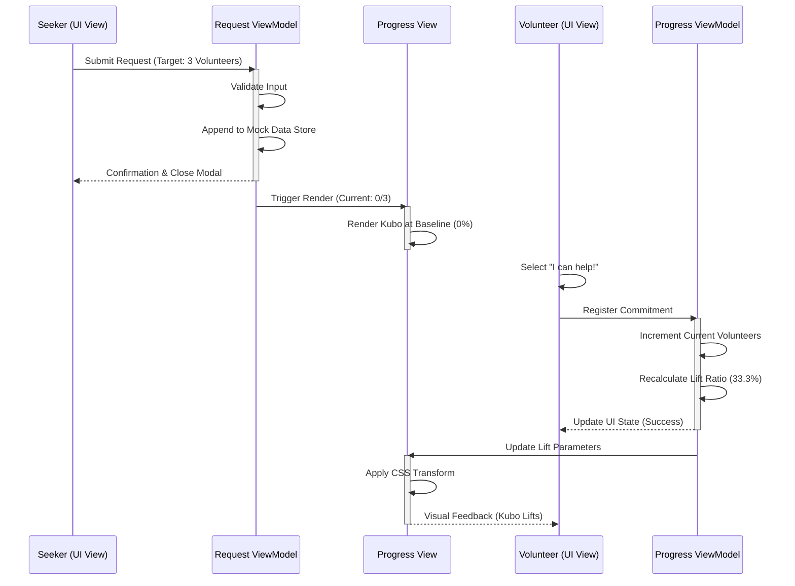
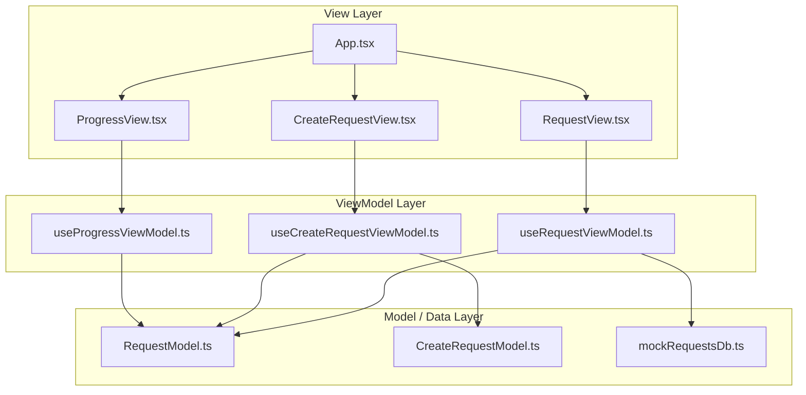

# Bayanihan Board: Frontend Prototype Specification

**Project Code**: AE-GRP-5 (Project 5)  
**Architecture Pattern**: React + TypeScript MVVM (Pure Frontend Prototype / Static Data Mocking)

---

## 1. User Journey Flow & Scenario

**Scenario: Posting and Coordinating a Community Move.**
A Seeker creates a request requiring 3 volunteers. As volunteers register their contributions, the application state mutates directly inside the frontend ViewModel layer. This drives the visual SVG offset height layout dynamically without external backend infrastructure dependencies.

| Step | Target Domain | Functional Sequence / Data State Mutation |
| :--- | :--- | :--- |
| 1 | **Seeker (View)** | Initiates help request configuration profile (e.g., Target Volunteers: 3). |
| 2 | **Request ViewModel** | Validates structural requirements and appends object to mock array runtime layer. |
| 3 | **Progress View** | Initializes rendering sequence; positions animated SVG Bahay Kubo at baseline level (0%). |
| 4 | **Volunteer (View)** | Triggers commitment selection handler via action click ("I can help!"). |
| 5 | **Progress ViewModel** | Increments metrics directly within state array wrapper. Recalculates lift variable ratio (33.3%). |
| 6 | **Progress View** | Applies updated ratio parameter directly to CSS transform positioning property. SVG raises. |

---

## 2. User Journey & Strategic Call Flow Diagram



---

## 3. Architecture Justification: Structured Local Architecture

*   **Scope Alignment**: Since the prototype target is limited to purely frontend testing with static mock data profiles, a decentralized microservices approach is eliminated to rule out network overhead, asynchronous gateway topologies, and synchronization latency tracking.
*   **State Synchronization**: Local application storage hooks mirror database transactions directly in memory (RAM), allowing rapid data processing loop execution for verification of visual presentation layout properties.

---

## 4. MVVM Structure & Directory Diagram

The system transforms structural design paradigms using explicit directory boundaries defining clear layer roles:

*   **Model**: Pure TypeScript interfaces, type signatures, and baseline dataset configuration shapes without runtime functionality modules.
*   **ViewModel**: Extracted custom React hook layer managing reactive tracking hook methods, updates, validations, and transform calculations.
*   **View**: JSX/TSX layout file structures completely stripped of computational execution routines, deriving variable models strictly via custom hooks.



---

## 5. Prototype Code Architecture Blueprint

### Unified Frontend Directory Structure
```text
src/
├── contexts/
│   └── LanguageContext.tsx      # Language translator logic
├── features/
│   ├── create-request/
│   │   ├── model/
│   │   ├── view/
│   │   └── viewmodel/
│   ├── request-flow/
│   │   ├── model/
│   │   ├── view/
│   │   └── viewmodel/
│   └── visual-progress/
│       ├── view/
│       └── viewmodel/
├── mock/
│   └── mockRequestsDb.ts        # Static Database
└── shared-components/
    └── Button/
```

### Mock State Store Model Implementation (RequestModel.ts)

```typescript
// src/features/request-flow/model/RequestModel.ts
export interface HelpRequest {
  id: string;
  title: string;
  type: 'moving' | 'medical' | 'fundraiser';
  targetVolunteers: number;
  currentVolunteers: number;
  commitments: Array<{ volunteerName: string; contribution: string }>;
}
```

```typescript
// src/mock/mockRequestsDb.ts
import type { HelpRequest } from '../features/request-flow/model/RequestModel';

export const mockRequestsDb: HelpRequest[] = [
  {
    id: "req-101",
    title: "Bayanihan Move: Mang Juan's House",
    type: "moving",
    targetVolunteers: 3,
    currentVolunteers: 1,
    commitments: [{ volunteerName: "Alejandro", contribution: "Heavy lifting labor" }]
  }
];
```

---

## 6. Vercel Deployment Process

Since this is a Vite-powered React application using Tailwind CSS v4, the deployment process to Vercel is streamlined.

### Step 1: Pre-Deployment Checks
Ensure your code builds successfully locally without TypeScript errors.
```bash
npm run build
```

### Step 2: Push to GitHub
Commit all your changes and push them to a GitHub repository.
```bash
git add .
git commit -m "chore: prepare for vercel deployment"
git push origin main
```

### Step 3: Vercel Dashboard Configuration
1. Log in to [Vercel](https://vercel.com/) and click **Add New Project**.
2. **Import** the GitHub repository containing the Bayanihan Board.
3. Configure the Build Settings:
   *   **Framework Preset**: Vite
   *   **Build Command**: `npm run build`
   *   **Output Directory**: `dist`
   *   **Install Command**: `npm install`
4. Click **Deploy**.

### Step 4: Verification
Once Vercel completes the build, it will generate a live URL (e.g., `https://bayanihan-board.vercel.app`).
Visit the URL to ensure the static data mocked DB and visual SVGs are rendering smoothly on the live server.
