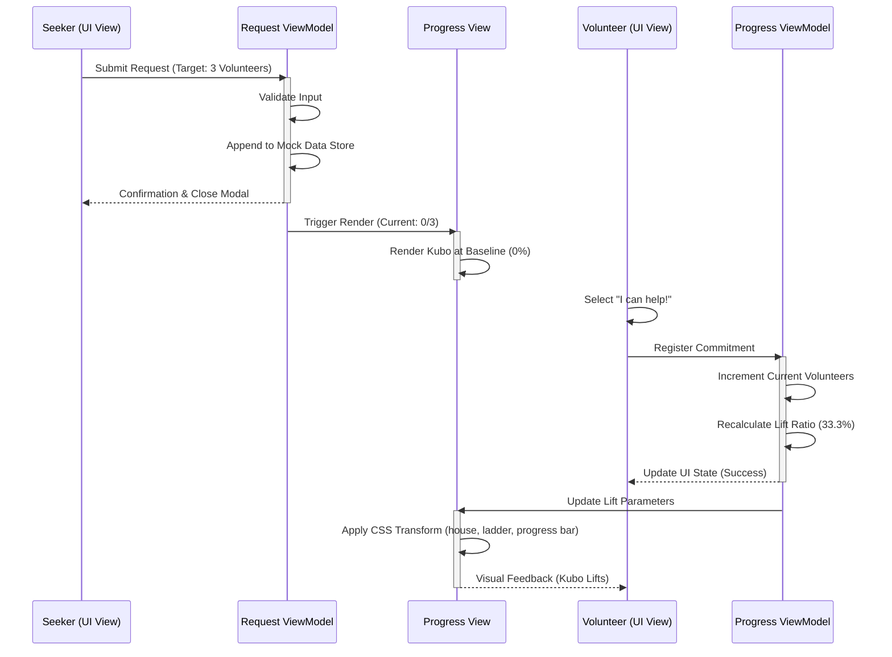
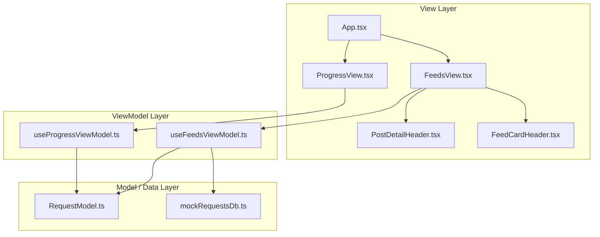

# Bayanihan Board: Frontend Prototype Specification

## Project Overview
A lightweight frontend prototype demonstrating a community‑help request flow using **React**, **TypeScript**, and **Vite**. The app runs entirely in the browser with static mock data, showcasing a clean MVVM architecture and an interactive animated SVG Bahay Kubo visualisation.

## Architecture Pattern
**React + TypeScript MVVM** – Pure frontend prototype with static data mocking. No backend services are required.

---

## 1. User Journey Flow & Scenario
**Scenario:** A seeker creates a request that needs volunteers. As volunteers register their contributions, the frontend state mutates directly inside the ViewModel layer, driving an animated SVG lift layout.

| Step | Target Domain | Functional Sequence / Data State Mutation |
| :--- | :--- | :--- |
| 1 | **Seeker (View)** | Initiates help request configuration (e.g., target volunteers: 3). |
| 2 | **Request ViewModel** | Validates input and appends object to mock array runtime layer. |
| 3 | **Progress View** | Initializes rendering sequence; positions animated SVG Bahay Kubo at baseline level (0%). |
| 4 | **Volunteer (View)** | Triggers commitment selection handler via "I can help!" button. |
| 5 | **Progress ViewModel** | Increments metrics directly within state array wrapper. Recalculates lift ratio (33.3%). |
| 6 | **Progress View** | Applies updated ratio to CSS transform. SVG raises, ladder grows, progress pill updates. |

---

## 2. User Journey & Strategic Call Flow Diagram


---

## 3. Architecture Justification: Structured Local Architecture
* **Scope Alignment:** The prototype targets a purely frontend environment with static mock data, eliminating the need for micro‑services, network overhead, and async gateway complexities.
* **State Synchronization:** Local in‑memory stores mirror typical database transactions, enabling rapid data processing loops for visual verification.

---

## 4. MVVM Structure & Directory Diagram
The system enforces clear layer boundaries:
* **Model:** TypeScript interfaces and static data shapes.
* **ViewModel:** Custom React hooks managing reactive state, validation, and calculations.
* **View:** JSX/TSX components that render UI and consume ViewModel hooks.



---

## 5. Prototype Code Architecture Blueprint
### Unified Frontend Directory Structure
```
src/
├── contexts/
│   └── LanguageContext.tsx          # Language translator logic
├── features/
│   ├── feeds/                       # Main feed, cards, sidebar, post detail
│   │   └── view/components/
│   │       ├── FeedCard/
│   │       │   ├── FeedCardHeader.tsx   # MapPin location icon + neighborhood
│   │       │   ├── FeedCardImage.tsx    # Multi-image carousel
│   │       │   └── FeedCardActions.tsx  # Help & Share buttons
│   │       ├── PostDetail/
│   │       │   └── PostDetailHeader.tsx # MapPin icon, neutral stone badge
│   │       └── SquareFeedCard.tsx
│   ├── hotlines/                    # Emergency hotlines view
│   ├── leaderboard/                 # Volunteer leaderboard view
│   ├── news/                        # Community news view
│   ├── post-request/                # Post creation modals
│   ├── progress/                    # Animated Bahay Kubo SVG
│   │   └── view/ProgressView.tsx    # Pill progress bar + dynamic ladder
│   └── requests/                    # Request models and state
├── mock/
│   └── mockRequestsDb.ts            # Static Database
└── shared-components/
    └── Button/
```

### Key Feature: Animated Bahay Kubo (`ProgressView`)
The `ProgressView` renders a fully animated SVG Bahay Kubo that responds to volunteer progress:

| Element | Behaviour |
| :--- | :--- |
| **House** | Translates upward via `liftPx` as volunteer ratio increases |
| **Bamboo Poles** | Appear one-per-volunteer and extend as the house lifts |
| **Ladder** | Dynamically spans from ground to rising floor, auto-adding rungs as it grows |
| **Windows** | Open dark interior with swaying pink curtains (no frames/glass) |
| **Door** | Animated 3D perspective swing open/close on a 6s infinite loop |
| **Progress Bar** | Minimal pill bar above the kubo with `% lifted` label in dark green |
| **Completion** | Full overlay fade-in with "BAYANIHAN COMPLETE!" & checkmark |

### `HelpRequest` Model
```typescript
// src/features/requests/model/RequestModel.ts
export interface HelpRequest {
  id: string;
  title: string;
  type: 'moving' | 'medical' | 'fundraiser' | 'other';
  customType?: string;
  neighborhood: string;
  needs: string;
  whenISO: string;
  targetVolunteers: number;
  currentVolunteers: number;
  commitments: Commitment[];
  imageUrl?: string;
  imageUrls?: string[];
}
```

---

## 6. Recent UI Changes
| Date | Change |
| :--- | :--- |
| 2026-06-25 | Redesigned progress bar to minimal pill style with `% lifted` label in dark green |
| 2026-06-25 | Refactored Bahay Kubo SVG door to an open doorway with 3D animated door swing |
| 2026-06-25 | Replaced window panels with open-interior windows and swaying pink curtains |
| 2026-06-25 | Fixed ladder: moved outside house group, anchored to ground, dynamically grows with liftPx |
| 2026-06-25 | Added `MapPin` icon to Feed Card header location (neighborhood) |
| 2026-06-25 | Added `MapPin` icon to Post Detail header location badge |
| 2026-06-25 | Removed green colour from Post Detail location badge (changed to neutral stone) |

---

## 7. Vercel Deployment Process
The project is built with **Vite** and **Tailwind CSS v4**.

### Step 1: Pre‑Deployment Checks
Ensure the app builds without TypeScript errors:
```bash
npm run build
```

### Step 2: Push to GitHub
```bash
git add .
git commit -m "feat(ui): redesign progress bar, kubo svg, location icons, and dynamic ladder"
git push origin main
```

### Step 3: Vercel Dashboard Configuration
1. Log in to Vercel and click **Add New Project**.
2. **Import** the GitHub repository containing the Bayanihan Board.
3. Configure Build Settings:
   * **Framework Preset**: Vite
   * **Build Command**: `npm run build`
   * **Output Directory**: `dist`
   * **Install Command**: `npm install`
4. Click **Deploy**.

### Step 4: Verification
After Vercel finishes building, visit the generated URL (e.g., `https://bayanihan-board.vercel.app`) to verify that the animated SVG, progress bar, and location icons all render correctly.

---

*This README reflects the current state of the project as of 2026-06-25, including all recent UI improvements to the Bayanihan Board prototype.*
