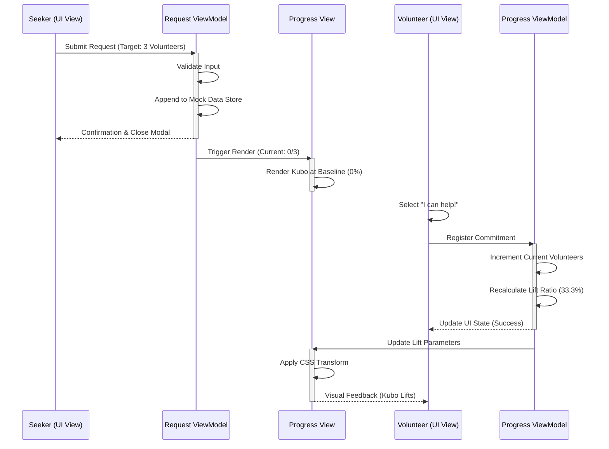
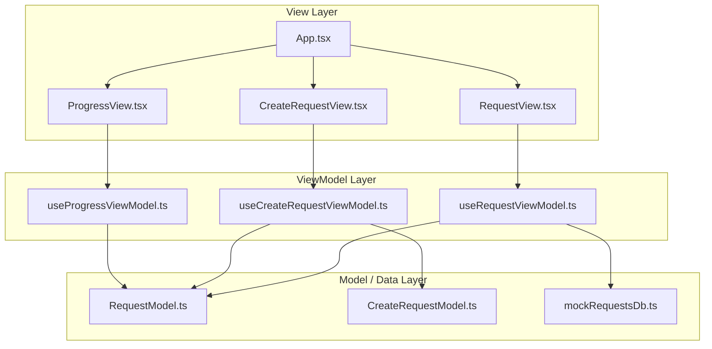

# Bayanihan Board: Frontend Prototype Specification

## Project Overview
A lightweight frontend prototype demonstrating a community‑help request flow using **React**, **TypeScript**, and **Vite**. The app runs entirely in the browser with static mock data, showcasing a clean MVVM architecture and interactive SVG visualisation.

## Architecture Pattern
**React + TypeScript MVVM** – Pure frontend prototype with static data mocking. No backend services are required.

---

## 1. User Journey Flow & Scenario
**Scenario:** A seeker creates a request that needs three volunteers. As volunteers register their contributions, the frontend state mutates directly inside the ViewModel layer, driving an animated SVG lift layout.

| Step | Target Domain | Functional Sequence / Data State Mutation |
| :--- | :--- | :--- |
| 1 | **Seeker (View)** | Initiates help request configuration (e.g., target volunteers: 3). |
| 2 | **Request ViewModel** | Validates input and appends object to mock array runtime layer. |
| 3 | **Progress View** | Initializes rendering sequence; positions animated SVG Bahay Kubo at baseline level (0%). |
| 4 | **Volunteer (View)** | Triggers commitment selection handler via "I can help!" button. |
| 5 | **Progress ViewModel** | Increments metrics directly within state array wrapper. Recalculates lift ratio (33.3%). |
| 6 | **Progress View** | Applies updated ratio to CSS transform property. SVG raises. |

---

## 2. User Journey & Strategic Call Flow Diagram


---

## 3. Architecture Justification: Structured Local Architecture
* **Scope Alignment:** The prototype targets a purely frontend environment with static mock data, eliminating the need for micro‑services, network overhead, and async gateway complexities.
* **State Synchronization:** Local in‑memory stores mirror typical database transactions, enabling rapid data processing loops for visual verification.

---

## 4. MVVM Structure & Directory Diagram
The system enforces clear layer boundaries:
* **Model:** TypeScript interfaces and static data shapes.
* **ViewModel:** Custom React hooks managing reactive state, validation, and calculations.
* **View:** JSX/TSX components that render UI and consume ViewModel hooks.



---

## 5. Prototype Code Architecture Blueprint
### Unified Frontend Directory Structure
```
src/
├── contexts/
│   └── LanguageContext.tsx      # Language translator logic
├── features/
│   ├── create-request/
│   │   ├── model/
│   │   ├── view/
│   │   └── viewmodel/
│   ├── request-flow/
│   │   ├── model/
│   │   ├── view/
│   │   └── viewmodel/
│   └── visual-progress/
│       ├── view/
│       └── viewmodel/
├── mock/
│   └── mockRequestsDb.ts        # Static Database
└── shared-components/
    └── Button/
```

### Mock State Store Model Implementation
```typescript
// src/features/request-flow/model/RequestModel.ts
export interface HelpRequest {
  id: string;
  title: string;
  type: 'moving' | 'medical' | 'fundraiser';
  targetVolunteers: number;
  currentVolunteers: number;
  commitments: Array<{ volunteerName: string; contribution: string }>;
}
```

```typescript
// src/mock/mockRequestsDb.ts
import type { HelpRequest } from '../features/request-flow/model/RequestModel';

export const mockRequestsDb: HelpRequest[] = [
  {
    id: "req-101",
    title: "Bayanihan Move: Mang Juan's House",
    type: "moving",
    targetVolunteers: 3,
    currentVolunteers: 1,
    commitments: [{ volunteerName: "Alejandro", contribution: "Heavy lifting labor" }]
  }
];
```

---

## 6. Vercel Deployment Process
The project is built with **Vite** and **Tailwind CSS v4**.

### Step 1: Pre‑Deployment Checks
Ensure the app builds without TypeScript errors:
```bash
npm run build
```

### Step 2: Push to GitHub
```bash
git add .
git commit -m "chore: prepare for Vercel deployment"
git push origin main
```

### Step 3: Vercel Dashboard Configuration
1. Log in to Vercel and click **Add New Project**.
2. **Import** the GitHub repository containing the Bayanihan Board.
3. Configure Build Settings:
   * **Framework Preset**: Vite
   * **Build Command**: `npm run build`
   * **Output Directory**: `dist`
   * **Install Command**: `npm install`
4. Click **Deploy**.

### Step 4: Verification
After Vercel finishes building, visit the generated URL (e.g., `https://bayanihan-board.vercel.app`) to verify that the mock data and SVG visualisation render correctly.

---

*This README has been updated to remove line‑number prefixes, reflect the current project dependencies, and improve overall readability and visual presentation.*
